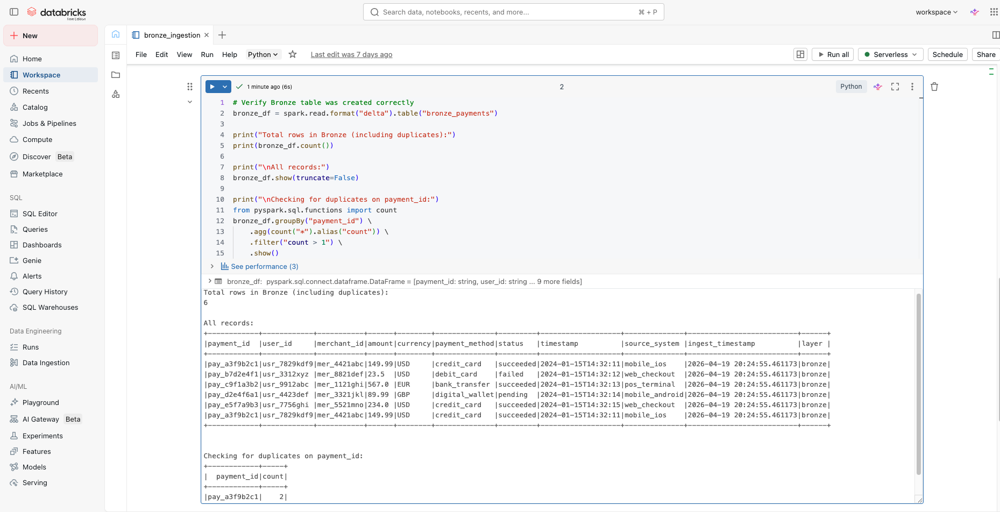
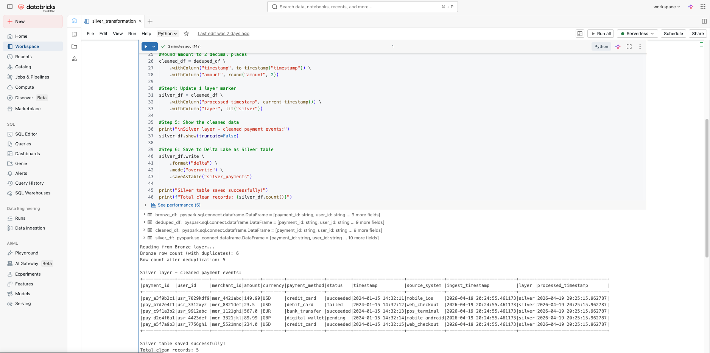
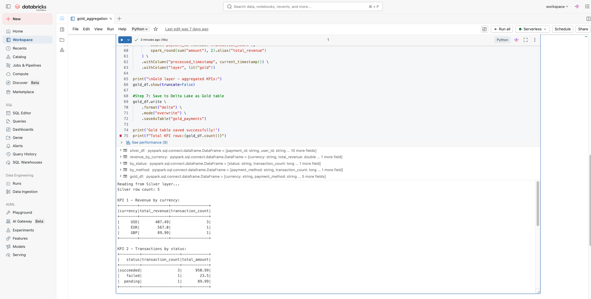
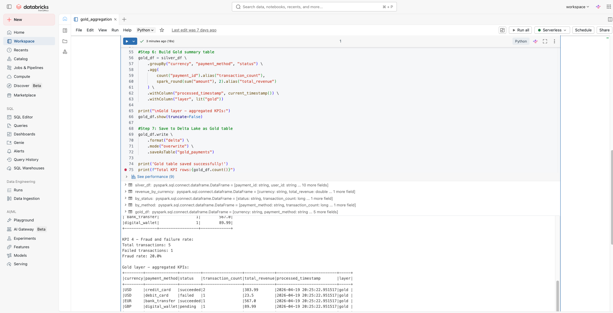

# Fintech Payments Data Pipeline

A production-grade real-time payments data pipeline that ingests, processes, and surfaces payment transaction insights using modern data engineering tools.

---

## What This Project Does

This pipeline simulates a real fintech payments platform where:
- Thousands of payment transactions happen every second
- Data must be processed in real time (not hours later)
- Fraud signals must be detected and surfaced immediately
- Business dashboards must always show fresh, accurate data
---

## Architecture

Payment Sources (Mobile, Web, POS, Stripe)
→ API Gateway (authentication + rate limiting)
→ Apache Kafka (real-time event streaming)
→ PySpark Structured Streaming (distributed processing)
→ Databricks Lakehouse: Bronze → Silver → Gold (Delta Lake)
→ Apache Airflow (orchestration + scheduling)
→ Power BI (dashboards + KPIs)

---

## Tech Stack

| Tool | Version | Purpose |
|------|---------|---------|
| Apache Kafka | 7.4.0 | Real-time event streaming and buffering |
| Apache Zookeeper | 7.4.0 | Kafka cluster management |
| PySpark | 4.1.1 | Distributed data processing |
| Delta Lake | 4.1.0 | ACID transactions, time travel, schema evolution |
| Databricks | Community Edition | Spark cluster and notebook environment |
| Apache Airflow | 2.x | Pipeline orchestration and scheduling |
| Power BI | Latest | Business intelligence and dashboards |
| Docker | 29.3.1 | Local Kafka and Zookeeper setup |
| Python | 3.11 | Producer scripts and pipeline code |

---

## Pipeline Layers — Medallion Architecture

### Bronze Layer — Raw Ingestion
- Reads payment events directly from Kafka topic payments.events
- Stores raw JSON exactly as received — zero transformations
- Acts as the audit trail and safety net
- If anything breaks downstream, we replay from Bronze

### Silver Layer — Transformation and Cleaning
- Reads from Bronze Delta table
- Deduplicates events using MERGE on payment_id
- Casts data types correctly
- Standardizes timestamps to UTC
- Validates required fields and flags nulls

### Gold Layer — Business Metrics
- Reads from Silver Delta table
- Aggregates KPIs: transaction volume, fraud signal rate, SLA adherence
- Optimized for fast Power BI queries

---

## Key Design Decisions

Why Kafka?
Payment sources generate unpredictable traffic spikes. Kafka acts as a buffer absorbing millions of events per second without overwhelming the processing layer. It also enables replay — if a bug is found, we reprocess from any point in history.

Why Delta Lake over plain Parquet?
Plain Parquet files have no ACID guarantees. A crashed pipeline write leaves corrupt partial files. Delta Lake adds a transaction log — every write is atomic. It also gives us time travel and schema evolution.

Why three layers?
Bronze is the safety net — raw data preserved forever. Silver is the single source of truth — clean and reliable. Gold is pre-aggregated for speed — dashboards query Gold directly without expensive computation at read time.

Why Airflow?
Without orchestration, pipeline jobs must be run manually in the right order. Airflow automates this — Bronze runs first, Silver only starts after Bronze succeeds, Gold only starts after Silver succeeds.

---

## Project Structure

fintech-payments-pipeline/
├── kafka/
│   └── docker-compose.yml
├── producer/
│   └── payment_producer.py
├── bronze/
│   └── bronze_ingestion.py
├── silver/
│   └── silver_transformation.py
├── gold/
│   └── gold_aggregation.py
├── airflow/
│   └── payments_dag.py
└── README.md

---

## Setup and Running Locally

### Prerequisites
- Mac or Linux machine
- Docker Desktop installed
- Python 3.11+
- Databricks Community Edition account (free)

### Step 1 — Clone the repository
git clone https://github.com/YOUR_USERNAME/fintech-payments-pipeline.git
cd fintech-payments-pipeline

### Step 2 — Install Python dependencies
pip3 install kafka-python faker pyspark delta-spark

### Step 3 — Start Kafka and Zookeeper
cd kafka
docker-compose up -d

### Step 4 — Start the payment producer
cd producer
python3 payment_producer.py

### Step 5 — Run Bronze, Silver, Gold notebooks in Databricks
Import and run in order:
1. bronze/bronze_ingestion.py
2. silver/silver_transformation.py
3. gold/gold_aggregation.py

---

## What I Learned Building This

- How to design a production medallion lakehouse architecture
- Why streaming pipelines need ACID guarantees (Delta Lake)
- How Kafka decouples producers from consumers at scale
- How to handle duplicate events with MERGE and idempotent writes
- How Airflow DAG dependencies prevent bad data from propagating
- Real-world tradeoffs between batch and streaming processing

---

## Future Improvements

- Add real-time fraud detection model in the Silver layer
- Implement dead letter queue for failed events
- Add data quality checks using Great Expectations
- Deploy on AWS using MSK (managed Kafka) and EMR (managed Spark)
- Add CI/CD pipeline with GitHub Actions

---

## Author

Shubhrata Gupta
Data Analytics Engineer 
LinkedIn: https://www.linkedin.com/in/shubhrata-gupta/
GitHub: https://github.com/shubhratag